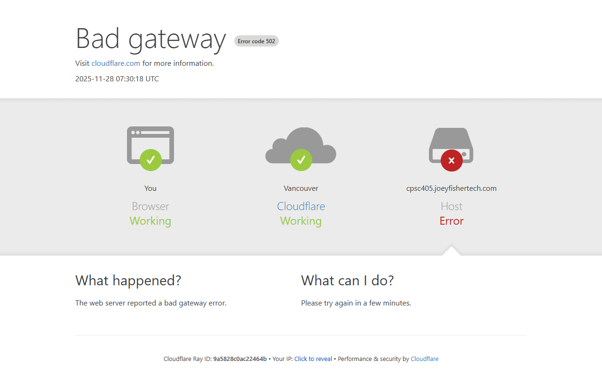
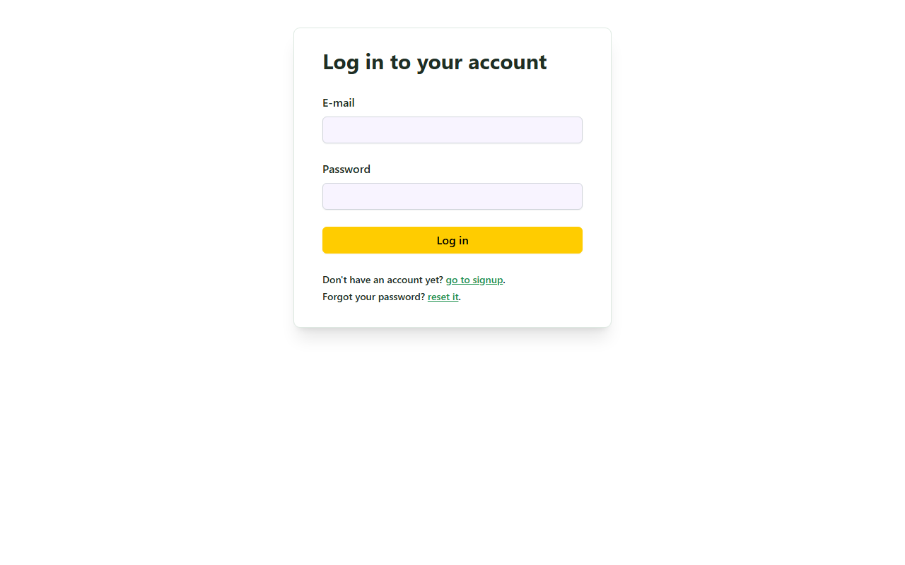
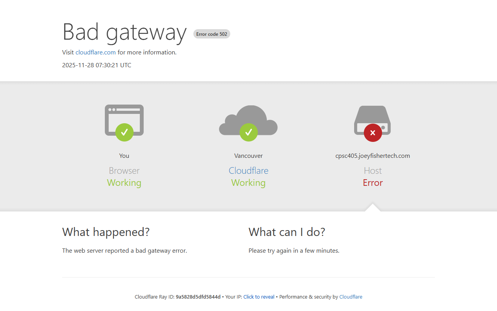

# Quest Canada - User Guide

Quest Canada is a web application for tracking and managing climate action progress across Canadian communities. This guide will help you navigate and use the application effectively.

## Table of Contents

1. [Getting Started](#getting-started)
2. [Public Pages](#public-pages)
3. [Authentication](#authentication)
4. [Assessments](#assessments)
5. [Projects](#projects)
6. [Admin Features](#admin-features)

---

## Getting Started

### Accessing the Application

The Quest Canada application is available at: **https://cpsc405.joeyfishertech.com**

### System Requirements

- Modern web browser (Chrome, Firefox, Safari, Edge)
- Internet connection
- JavaScript enabled

---

## Public Pages

### Landing Page

The landing page provides an overview of Quest Canada's mission: **Supporting Canadian Communities on the Pathway to Net-Zero**.

**Key Features:**
- **View Assessments** button - Access public assessment data
- **Get Started** button - Navigate to signup/login
- Cookie consent banner for privacy compliance

### Public Dashboards

The dashboards page displays public climate data visualizations and analytics using embedded Grafana dashboards.

---

## Authentication

### Login

To access protected features, you need to log in with your credentials:

1. Navigate to `/login` or click "Log in" in the header
2. Enter your email address
3. Enter your password
4. Click "Log in"

**Forgot your password?** Click the "reset it" link to request a password reset.

### Sign Up

New users can create an account:

1. Navigate to `/signup` or click "go to signup" on the login page
2. Enter your email address
3. Create a strong password
4. Click "Sign up"
5. Verify your email address via the confirmation email

---

## Assessments

Assessments are the core feature of Quest Canada, allowing users to track climate action benchmarks for communities.

### Viewing Assessments

Navigate to `/assessments` after logging in to see all assessments. Each assessment includes:

- Community name and region
- Assessment date
- Overall score
- Status (Draft/Published)

### Creating a New Assessment

1. Click "New Assessment" button
2. Fill in the assessment form:
   - **Community Information**: Name, region, population
   - **Assessment Details**: Date, assessor name, notes
   - **10 Indicator Scores**: Rate each indicator from 1-10
     1. Leadership & Governance
     2. Climate Action Planning
     3. Energy Management
     4. Buildings & Infrastructure
     5. Transportation
     6. Waste Management
     7. Water Management
     8. Land Use & Nature
     9. Community Engagement
     10. Economic Development
   - **Strengths**: Document community strengths
   - **Recommendations**: Add improvement recommendations

3. Save as Draft or Publish

### AI-Powered PDF Import

Navigate to `/assessments/import` to import assessments from PDF documents:

1. Upload a PDF containing assessment data
2. AI extracts information automatically
3. Review and edit extracted data
4. Confirm import to create assessment

### Viewing Assessment Details

Click on any assessment to view:
- Full indicator scores with descriptions
- Strengths identified
- Recommendations for improvement
- Export to PDF option

---

## Projects

Climate action projects can be tracked and managed through the Projects module.

### Viewing Projects

Navigate to `/projects` to see all climate action projects. Each project shows:

- Project name and description
- Associated community
- Status and progress
- Funding information

### Creating a New Project

1. Click "New Project" button
2. Fill in project details:
   - **Basic Info**: Name, description, community
   - **Timeline**: Start date, end date, milestones
   - **Funding**: Funding sources and amounts
   - **Partners**: Project partners and stakeholders

3. Save the project

### Project Details

Click on any project to view:
- Full project description
- Milestone timeline
- Funding breakdown
- Progress updates
- Related recommendations from assessments

---

## Admin Features

Admin users have access to additional features for managing the application.

### Analytics Dashboard (`/admin`)

View application analytics including:
- User statistics
- Assessment counts
- Project metrics
- System health

### User Management (`/admin/users`)

Manage user accounts:
- View all registered users
- Update user roles
- Enable/disable accounts

### Settings (`/admin/settings`)

Configure application settings:
- Email settings
- API configurations
- Feature toggles

---

## Account Settings

Navigate to `/account` to manage your account:

- Update profile information
- Change password
- View activity history
- Manage preferences

---

## Tips & Best Practices

1. **Regular Assessments**: Conduct assessments annually to track progress
2. **Complete Data**: Fill in all indicator scores for accurate benchmarking
3. **Document Strengths**: Record what's working well to share best practices
4. **Actionable Recommendations**: Write specific, achievable recommendations
5. **Link Projects**: Connect projects to assessment recommendations

---

## Getting Help

If you need assistance:

1. Click the **Help** button in the application header
2. Check this user guide
3. Contact your administrator

---

## Keyboard Shortcuts

| Shortcut | Action |
|----------|--------|
| `?` | Open help dialog |
| `Esc` | Close modals/dialogs |

---

*Quest Canada - Supporting Indigenous-led climate action across Canada*
